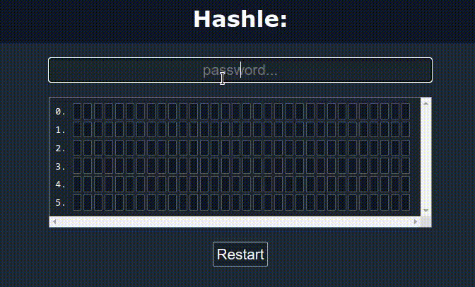
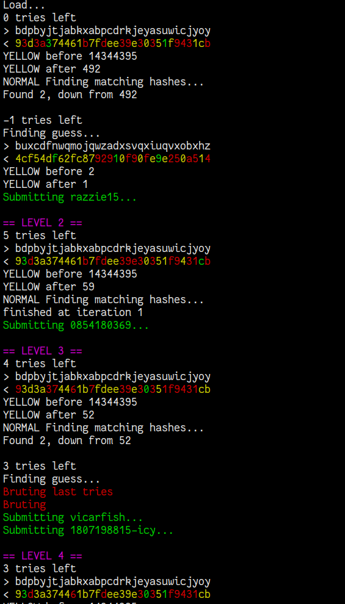
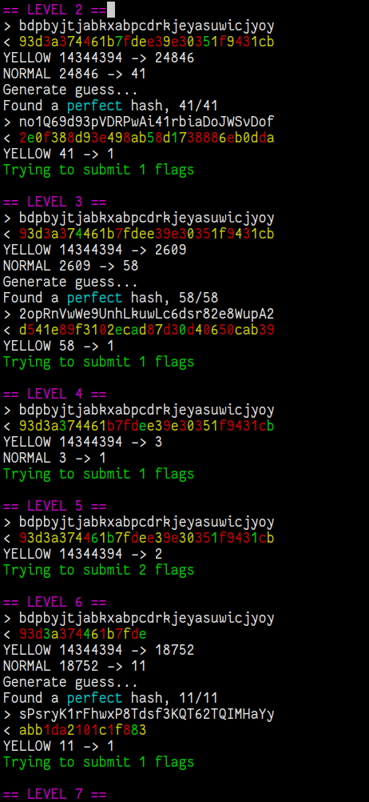

# Hashle writeup
We're given a wordle-like website where we can guess passwords, and it will
tell us which nibbles of the corresponding hash are correct. This seemed like a
fun task, and reminded me of
[passwordle](https://rsk0315.github.io/playground/passwordle.html). I must say
i was quite surprised by how few guesses hashes are needed in the end for such
short hashes! We really enjoyed this task!



# Info
By clicking the question-mark in the top right we get some short info on how
the application works. This actually comes quite in handy, and the part about

> Yellow is counted to the correct amount of times

was a major factor in our solution.

It's worth noting that it uses MD5 and not SHA256, and that the server picks a
random password from `rockyou.txt`.

Terminology: I will call the colors returned **hints**, in accordance with the
API.

# Nitty gritty
We quickly discovered that the server has a JSON API, and so we quickly
implemented a python script to interact with it, and started making sense of
the data. We first `GET /api/session` which returns us a token which we will
use for the entirety of this run: `{"token":"egZNffStlY2UtzBhhXLa", ...}`.
After that the only other endpoint we will use is the `POST /api/session` one.

The format there is `{"token":"egZNffStlY2UtzBhhXLa","password":"amogus"}`,
which returns something like
```json
{
  "hash": [
    {
      "hint": "yellow",
      "char": "c"
    },
    {
      "hint": "none",
      "char": "a"
    },
    {
      "hint": "yellow",
      "char": "e"
    },
    {
      "hint": "yellow",
      "char": "0"
    },
    {
      "hint": "yellow",
      "char": "2"
    },
    {
      "hint": "green",
      "char": "0"
    },
    ...
  ],
  "password": "amogus",
  "token": "iwMcNIgdBArzTO6iTUwz",
  "expire": "2022-11-06T22:29:44.406Z",
  "level": 1,
  "attempt": 1,
  "max_attempts": 6,
  "length": 32,
  "flag": "Correct!"
}
```

Corresponding to the following image:


The basic idea is to iteratively guess a possible password, and use the
resulting wordle-like "hints" to remove *im*possible passwords from rockyou.
For instance if we get a green `5` as the first hex in the hash, we know that
only passwords that start with a `5` in their MD5-hash can be correct, and we
can discard all other posibillities. We then do this until the remaining hashes
is 1 (or alternatively less than our remaining guesses, then we can brute the
remaining posibillities).

Eventually we solved one, but was greeted with a `{..., "level": 2, ...}`, so
we had to go back to the think box.

Øyvind on our team found multiple optimizations, and in the end they boiled
down to one of two things.

1. guess smarter
2. use the hints smarter

## guessing better
The idea of guessing more intelligently is that if we have a set of remaining
possible passwords, we can generate a random password such that it maximizes
the predictive effect. In the best case we guess a password so that no matter
the correct answer, the hash of this guess will give us enough information to
uniquely decide this.

Our code for this is actually slightly wrong as we have `yellow = it exists but
not here`, instead of what i described in the info section in the beginning,
but it ended up beeing a good analogue.

The idea for our implementaiton is not very complex, just try many random
passwords, and see how well their hashes would perform.

He also generated a pretty optimal initial guess of
`bdpbyjtjabkxabpcdrkjeyasuwicjyoy`, based on the same method, but since we
don't have any info at the start it's easier and faster to hard-code it.

```py
def findguess(hashes, its, size):
    # return a unique value representing the hints we would get if we guessed
    # guess when has was correct
    def compare(guess, hash):
        out = 0
        for i in range(len(guess)):
            if hash[i] == guess[i]:
                n = 0
            elif str.find(hash, guess[i]) != -1:
                n = 2
            else:
                n = 1
            out += n
            out <<= 2 # edit this if add back middle
        return out

    def find_num_uniq(hashes, guess):
        uniq = set()
        for cur_hash in hashes:
            uniq.add(compare(guess, cur_hash))
        return len(uniq)

    best = 0
    bestguess = ""
    letters = string.ascii_lowercase
    for _ in range(its):
        guess = ( ''.join(random.choice(letters) for _ in range(32)) )
        guess_md5 = hashlib.md5(bytes(guess, 'utf-8')).hexdigest()[:size]
        score = find_num_uniq(hashes, guess_md5)
        if score > best:
            best = score
            bestguess = guess
    # print(f"Best guess: {bestguess}, uniq: {best}")
    return bestguess
```

## using hints better
As for using hints, the naive way is to just filter away all passwords which
have mismatching characters in the hash compared to the known-green ones. A
really important observation for our implementation is the yellow characters.
If we have 1 green, 2 yellow and 3 black `d`s, we know that there are exactly 3
`d`s in the has. This lets us filter away extremely many hashes, something like
100-1000 hashes left after one single guess, approx `-99.995%`. Imma refer to
it as the **yellow algorithm** :)).

The other algorithm we used, the **normal algorith**, simply keep track of
possible characters in each position. The way we keep track of this is to keep
a set of possible characters for each position in the hash. Initially `[0-f]`,
and whenever we get a green hint we set the set to only contain that one hint,
and whenever we get a yellow hint we remove the character we submitted (since
it was not correct). We can then use that to filter away those that are not
possible.

## remaining part
The hardest part of this task was probably making it work consequently. Just
reading the pre-hashes password list takes many seconds on my shitty laptop,
and running the whole program would take many minutes. We also had to fine tune
how many of the hashes left we would look at when running the yellow algorithm,
but in hindwight i think this was a mistake as we would kinda guess blind. We
should instead have had a lower iterations count, i think.



You can find the code in `solve.py`.

## faster!
I also spent the night after the CTF trying to write a faster solution, which
can be found in the `rs` directory. This one seems to work pretty reliably, but
still not *always*.



## flag
When you finish level 16, the flag field returned is set to `"flag":"Correct!
Here have a flag: EPT{1_5we4r_i7_w4s_n0t_ju5t_4_f4d}"` and our flag is obvious,

**`EPT{1_5we4r_i7_w4s_n0t_ju5t_4_f4d}`**


## Thoughts
In the beginning i implemented the correct-checker by checking if the hash was
entirely correct (all green), but it seemed more robust to instead check that
the level incremented. This also means that if we got a colission on the
smaller hashes near the end levels, we would still be able to figure out the
next one, even if we had two passwords with the same short hash. In the end it
should be quite rare and we can assume that EPT hasn't purposefully picked
passwords with hash collissions. It's also rockyou so they couldn't have
generated passwords specifically for this.

One interesting thing about our solution is that it would struggle a lot more
in the beginning as the guesses per level decreased, but once they started
increasing to compansate for the shorter hashes, it was a walk in the park. I
wonder how we deviated from the intended solution.
